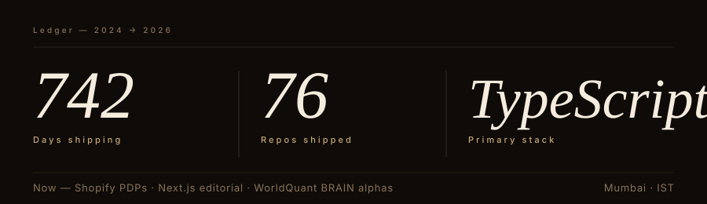

---

Full-stack engineer building production web apps end-to-end — React & Next.js on the frontend, Node.js / NestJS / Express on the backend, PostgreSQL and Prisma at the data layer. I own features from schema design through API contracts, business logic, UI, testing, and deploy. Comfortable across the whole request lifecycle: DB indexes, cache patterns, auth flows, background jobs, CI/CD, Docker.

### Currently building

- **[MentorLeap](https://github.com/Sayuj63/mentor-leap-final-version)** &nbsp;·&nbsp; full-stack mentorship platform. Multi-role auth (mentor / mentee / admin), booking flow with slot management, mentor dashboard, Next.js App Router + Prisma + Postgres.
- **[handld](https://github.com/Sayuj63/handld)** &nbsp;·&nbsp; client change-request portal — RBAC, email notifications, ticket workflows, audit trail. Next.js + Postgres.
- **[SIH 2026 Portal](https://github.com/Sayuj63/sih-2026-portal)** &nbsp;·&nbsp; internal-hackathon registration portal for ISU. Next.js 16 + Prisma + Supabase Postgres, single-page team form with server-actions and real-time validation.

### Stack

**Frontend** &nbsp;·&nbsp; `TypeScript` `Next.js` `React` `Tailwind` `GSAP` `Framer Motion` `Three.js` &nbsp;
**Backend** &nbsp;·&nbsp; `Node.js` `NestJS` `Express` `REST` `JWT` `OpenAPI` &nbsp;
**Data** &nbsp;·&nbsp; `PostgreSQL` `Prisma` `Supabase` `Redis` `Convex` &nbsp;
**Infra** &nbsp;·&nbsp; `Docker` `Terraform` `GitLab CI` `Vercel` `Cloudflare Workers` `AWS`

---

### *Ledger*

 

---

### Selected work

| Repo | What it is |
| :--- | :--- |
| [`mentor-leap-final-version`](https://github.com/Sayuj63/mentor-leap-final-version) | Full-stack mentorship platform — multi-role auth, booking, dashboards |
| [`handld`](https://github.com/Sayuj63/handld) | Client change-request portal with RBAC + email notifications |
| [`sih-2026-portal`](https://github.com/Sayuj63/sih-2026-portal) | Next.js 16 + Prisma + Supabase Postgres registration portal |
| [`Fitness-tracking-api`](https://github.com/Sayuj63/Fitness-tracking-api) | TypeScript REST API — Express + Prisma + JWT + OpenAPI |
| [`SIM-Provisioning-Automation-Platform`](https://github.com/Sayuj63/SIM-Provisioning-Automation-Platform) | DevOps case study — Docker, Terraform, CI/CD pipelines |
| [`System-Design`](https://github.com/Sayuj63/System-Design) | Rate limiters, consistent hashing, LRU cache, message queues |
| [`donna-voice-hermes`](https://github.com/Sayuj63/donna-voice-hermes) | Realtime voice agent — Cloudflare Workers + WebRTC + OpenAI Realtime |
| [`CARAMEL-STUDIO`](https://github.com/Sayuj63/CARAMEL-STUDIO) | Next.js 16 + React 19 + Three.js editorial photography site |

---

### How I work

- **Full-stack ownership** — schema → API → UI → tests → deploy, one engineer, one thread.
- **Edge cases first** — I map failure modes and concurrency before writing the happy path.
- **Boring is better** — small MRs, additive migrations, obvious code, aggressive tests around anything that touches money or auth.
- **Mentorship** — I pair with juniors on early tickets and review code as teaching, not gatekeeping.

---

### A year, drawn

  <picture>
    <source media="(prefers-color-scheme: dark)" srcset="https://raw.githubusercontent.com/Sayuj63/Sayuj63/output/github-contribution-grid-snake-dark.svg"/>
    <source media="(prefers-color-scheme: light)" srcset="https://raw.githubusercontent.com/Sayuj63/Sayuj63/output/github-contribution-grid-snake.svg"/>
    
  </picture>

---

  

